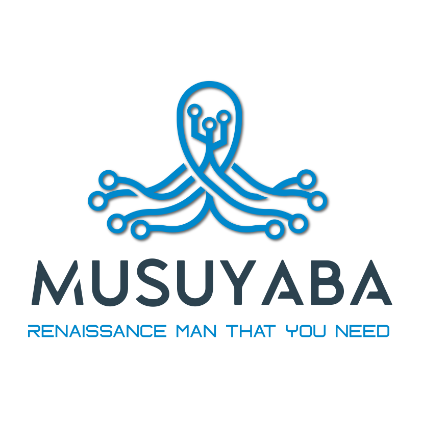

# Greetings~  My Name is Musuyaba

## :octopus: About Me

Lorem ipsum dolor sit amet, consectetur adipiscing elit. Aenean rutrum efficitur arcu faucibus fringilla. Pellentesque vel mollis tellus. Vivamus ac arcu nisl. Vestibulum rutrum quam nec accumsan porttitor. Pellentesque in pretium metus. Proin vulputate nulla a ex porta, non semper elit venenatis. Sed vitae ligula ut mi viverra volutpat nec a odio. In sed molestie justo. Curabitur tincidunt rhoncus ornare. Suspendisse potenti.

Duis in eleifend leo. Proin aliquam nisi ipsum, in fringilla erat scelerisque et. Etiam aliquam, nisl id malesuada hendrerit, purus dolor dapibus ante, ac dignissim libero risus ac lacus. Nullam at bibendum ante. Cras a tristique nulla. Curabitur tristique egestas sem, in placerat felis rhoncus sed. Donec rutrum ex vel purus scelerisque gravida.

## :flags: My Stats

<table>
  <tr>
    <td></td>
    <td>
    </td>
  </tr>
  <tr>
    <td colspan="2"></td>
  </tr>
</table>

## :carousel_horse: Open Source Projects

- IoT Stack ([Git Repo](https://github.com/Musuyaba/iot-stack))
  - Mosquitto Stack ([Git Repo :fire:](https://github.com/Musuyaba/mosquitto-stack))
  - EMQX Stack ([:hammer:](https://github.com/Musuyaba))

## :books: Publications

## :comet: Skills & Technology

## :mailbox_with_mail: Contacts

## :zap: Links
